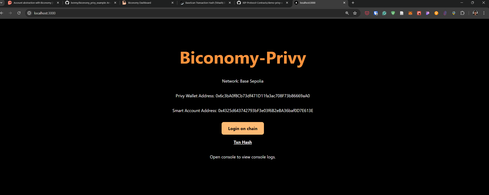
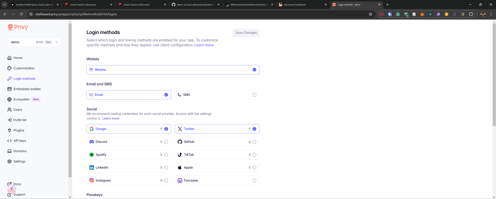
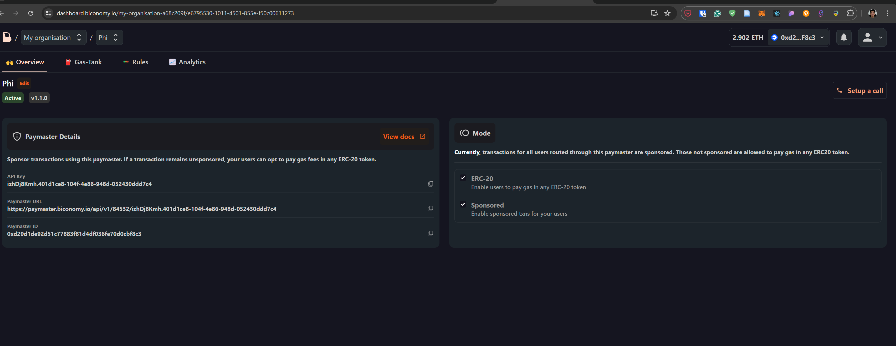

# Biconomy-Privy Integration with Next.js

This is a [Next.js](https://nextjs.org/) project that demonstrates the integration of Biconomy for gasless transactions and Magic for user authentication. It allows you to interact with a smart contract on the Polygon Amoy test network.



## Configurations
- Privy AppId: `cly5y2njc04whvv4lrd2b1trt`
- Biconomy ApiKey: `izhDj8Kmh.401d1ce8-104f-4e86-948d-052430ddd7c4`
- Biconomy BundleUrl: `https://bundler.biconomy.io/api/v2/${chainId}/izhDj8Kmh.401d1ce8-104f-4e86-948d-052430ddd7c4`

## Getting Started

To get started with this project, follow these steps:

1. Clone this repository to your local machine:

   ```bash
   git clone https://github.com/your-username/your-repo-name.git

2. Change to the project directory:

   ```bash
   cd your-repo-name

3. Install the project dependencies:

   ```bash
   npm install
   or
   yarn

4. Run the development server:

   ```bash
   npm run dev
   # or
   yarn dev

5. Setup login method

Go into privy dashboard https://dashboard.privy.io/
Setup to get appId for your project

```typescript
export default function App({ Component, pageProps }: AppProps) {
  return (
    <>
      <PrivyProvider
        appId="cly5y2njc04whvv4lrd2b1trt" //Use your own appId from https://dashboard.privy.io/
        config={{
          supportedChains: [baseSepolia], // <-- Add your supported chains here
          embeddedWallets: {
            createOnLogin: "users-without-wallets",
            noPromptOnSignature: true,
          },
          loginMethods: ["email", "google", "twitter"], // <-- Add your supported login methods here
        }}
      >
        <Component {...pageProps} />
      </PrivyProvider>
    </>
  );
}
```

Your login methods must match with



6. Setup gas bundle for Biconomy (only for the sponsor)

Go into biconomy dashboard https://dashboard.biconomy.io/

Setup to get the paymentMasterApi and bundleUrl



5. Open [http://localhost:3000](http://localhost:3000) in your web browser to access the application.

Open [http://localhost:3000](http://localhost:3000) with your browser to see the result.

You can start editing the page by modifying `pages/index.tsx`. The page auto-updates as you edit the file.

[API routes](https://nextjs.org/docs/api-routes/introduction) can be accessed on [http://localhost:3000/api/hello](http://localhost:3000/api/hello). This endpoint can be edited in `pages/api/hello.ts`.

The `pages/api` directory is mapped to `/api/*`. Files in this directory are treated as [API routes](https://nextjs.org/docs/api-routes/introduction) instead of React pages.

This project uses [`next/font`](https://nextjs.org/docs/basic-features/font-optimization) to automatically optimize and load Inter, a custom Google Font.


## Technologies Used

* [Next.js](https://nextjs.org/): A React framework for building web applications.
* [Biconomy](https://www.biconomy.io/): A gas-free transaction infrastructure for Ethereum and other blockchains.
* [Privy](https://www.privy.io/): A user authentication library for web applications.
* [Ethers.js](https://docs.ethers.org/v5/): A library for interacting with the Ethereum blockchain.


## Learn More

To learn more about the technologies used in this project, check out the following resources:

* [Next.js Documentation](https://nextjs.org/docs): Learn about Next.js features and API.
* [Biconomy Documentation](https://docs.biconomy.io/): Explore Biconomy's capabilities and integration guides.
* [Privy Documentation](https://docs.privy.io/): Learn how to use Privy for user authentication.
* [Ethers.js Documentation](https://docs.ethers.org/v5/): Explore the features and capabilities of Ethers.js.


## Deploy on Vercel

The easiest way to deploy your Next.js app is to use the [Vercel Platform](https://vercel.com/new?utm_medium=default-template&filter=next.js&utm_source=create-next-app&utm_campaign=create-next-app-readme) from the creators of Next.js.

Check out our [Next.js deployment documentation](https://nextjs.org/docs/deployment) for more details.
